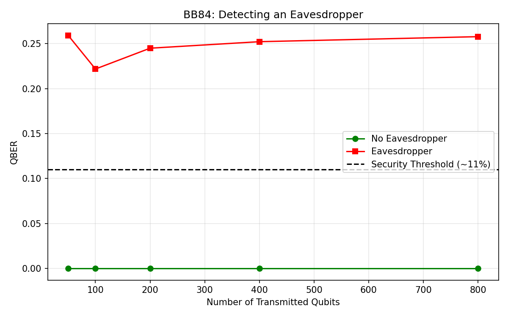
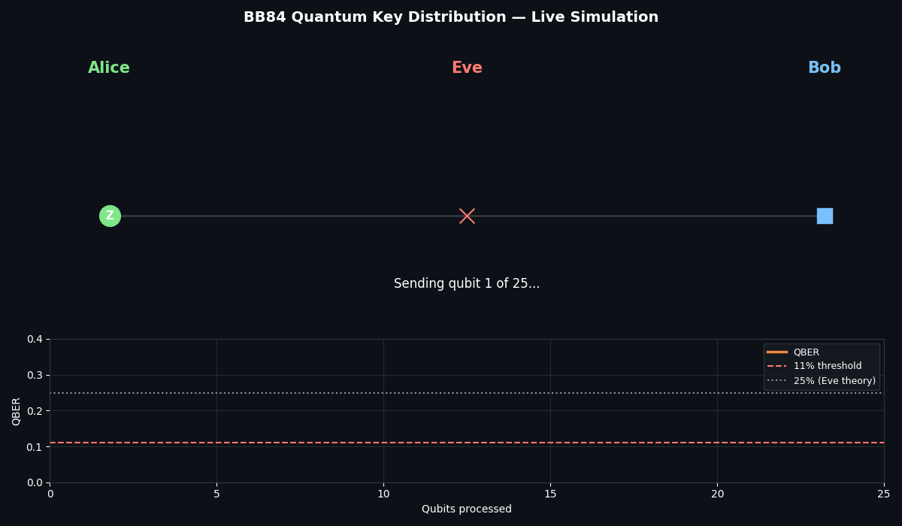
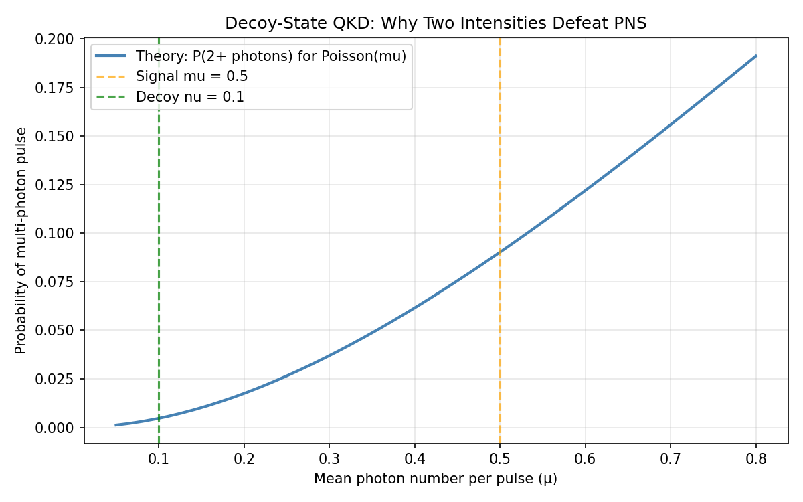

# BB84 Quantum Key Distribution Simulation

[](https://github.com/Kusai-quantum/bb84-qkd/actions/workflows/tests.yml)


> **Hardware-validated on IBM Quantum.** Core BB84 physics reproduced on the 156-qubit `ibm_fez` processor (IBM Quantum). Same-basis measurements showed 97–98% fidelity; different-basis measurements showed the expected ~50/50 randomness. See `real_hardware.py` and [job danvr3v8gn2s739n6ug0](https://quantum.ibm.com/jobs/danvr3v8gn2s739n6ug0).

📝 Read the full write-up on Medium: [I Built Quantum Cryptography in Python — And Caught an Eavesdropper in the Act](https://medium.com/@kossayalnasser1200/i-built-quantum-cryptography-in-python-and-caught-an-eavesdropper-in-the-act-072031575137)

A Python + Qiskit simulation of the **BB84 quantum key distribution protocol**, with eavesdropper detection, Cascade error correction, privacy amplification, and hardware validation on real IBM quantum processors.



## Live Simulation



*The dot travels from Alice to Bob. When Eve (the red X in the middle) intercepts and guesses the wrong basis, the dot turns red, and the QBER climbs toward 25%.*

## Motivation

Today's financial infrastructure relies on RSA and elliptic-curve cryptography — both broken by a sufficiently large quantum computer running Shor's algorithm. QKD is a physics-based alternative: security comes from the **no-cloning theorem** and the **measurement-disturbance principle**, not from computational hardness.

This project simulates BB84 end-to-end to demonstrate how banks could detect an eavesdropper using quantum physics alone.

## Features

- ✅ Full BB84 protocol: bit encoding, basis reconciliation, sifting
- ✅ **Intercept-resend eavesdropper** that introduces a measurable ~25% QBER
- ✅ **Channel noise simulation** (bit-flip probability)
- ✅ **Cascade error correction** to fix errors in the sifted key
- ✅ **Privacy amplification** via SHA-256 to compress the key against Eve's knowledge
- ✅ **PNS attack simulation** and **decoy-state defense** (advanced quantum attack)
- ✅ **Real IBM Quantum hardware validation** on the 156-qubit `ibm_fez` processor
- ✅ **Interactive animation** showing the protocol in real time (`animate.py`)
- ✅ **12 unit tests** covering every stage of the pipeline
- ✅ **GitHub Actions CI** running tests on every push

## Results

| Scenario | QBER |
|----------|------|
| No eavesdropper, no noise | ~0% |
| 5% channel noise | ~5% |
| Eavesdropper (intercept-resend) | ~25% |
| Security threshold | 11% |

The jump from 0% to 25% when Eve listens is the entire point of BB84: any eavesdropper is detectable.

### Advanced attack: Photon-Number-Splitting

Real lasers sometimes emit 2+ photons per pulse. Eve can steal one from each multi-photon pulse, learn the key bit, and introduce *zero* QBER — invisible to standard BB84. This repo includes a simulation of the attack and the decoy-state defense that detects it.



See `pns_attack.py` for details.

## Installation

```bash
git clone https://github.com/Kusai-quantum/bb84-qkd.git
cd bb84-qkd
pip install -r requirements.txt
```

## Usage

**Basic run (no eavesdropper):**
```bash
python bb84.py
```

**Simulate an eavesdropper:**
```bash
python bb84.py --eavesdrop
```

**Add 5% channel noise:**
```bash
python bb84.py --noise 0.05
```

**Full pipeline (sift → correct → amplify):**
```bash
python bb84.py --noise 0.05 --correct --amplify
```

**Generate the QBER plot:**
```bash
python bb84.py --plot
```

**Run the animation (creates `bb84_animation.gif`):**
```bash
python animate.py
```

**Simulate the PNS attack and decoy-state defense:**
```bash
python pns_attack.py
```

**Validate core BB84 physics on real IBM Quantum hardware:**
```bash
python real_hardware.py
```
*(Requires an IBM Quantum account and a `.env` file with `IBM_QUANTUM_TOKEN=...`. See `test_ibm.py` for a connection test.)*

**Run the test suite:**
```bash
pytest test_bb84.py -v
```

## How it works

### 1. The exchange
Alice picks a random bit and a random basis (Z or X) for each qubit, encodes it, and sends it to Bob. Bob measures in a randomly chosen basis.

### 2. Sifting
Alice and Bob publicly compare their bases (never their bits). Bits where the bases matched form the **sifted key**.

### 3. Eavesdropper detection (QBER)
If Eve intercepts and re-sends qubits, she guesses the wrong basis 50% of the time, causing Bob to get a random result 50% of those times. Result: **~25% QBER** — far above the 11% security threshold.

### 4. Cascade error correction
Alice and Bob use public parity comparisons and binary search to locate and fix residual errors — without ever revealing the key.

### 5. Privacy amplification
Both parties hash their key with SHA-256, compressing it into a shorter string that Eve has essentially zero information about.

### 6. Real hardware validation
The core physics is validated on IBM's `ibm_fez` superconducting processor. Same-basis measurements return Bob's bit with ~97–98% fidelity (the missing ~2% is real quantum decoherence). Different-basis measurements are random, as predicted.

## Tech Stack

- Python 3.10+
- Qiskit 1.x + Qiskit Aer + Qiskit IBM Runtime
- NumPy, SciPy, Matplotlib, Pillow
- Pytest for unit testing
- GitHub Actions for CI

## Limitations & Future Work

**Current limitations:**
- The simulation uses an idealized noise model. Real fiber channels include dark counts, detector inefficiency, and polarization drift.
- Cascade is a simplified version — production systems use multi-pass Cascade with optimized block sizes.
- The PNS analysis is illustrative, not a full security proof.

**Possible extensions:**
- Implement the **E91** entanglement-based protocol for comparison.
- Add **finite-key analysis** for realistic key-rate bounds.
- Integrate with a real QKD testbed (e.g., ID Quantique) for hardware validation.
- Explore **post-quantum cryptography** (lattice-based schemes) as an alternative approach.

## References

- Bennett, C. H., & Brassard, G. (1984). *Quantum cryptography: Public key distribution and coin tossing.*
- Shor, P. W., & Preskill, J. (2000). *Simple proof of security of the BB84 quantum key distribution protocol.*
- Qiskit documentation: https://qiskit.org

## License

This project is licensed under the MIT License — see the [LICENSE](LICENSE) file for details.
